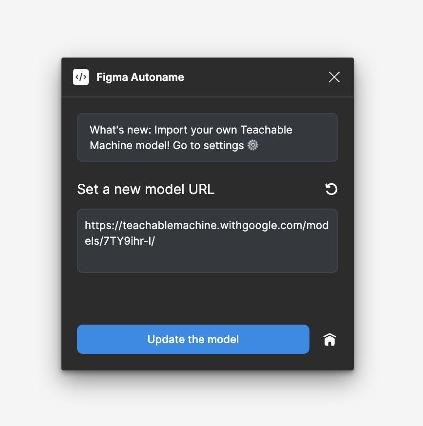

# 🪄 Figma Autoname plugin

Your today’s problem with this “Frame 563” is not really renaming it properly to “Button”, it’s more about the 562 other frames you have
to rename too. This plugin is an experiment to solve your problem right here, right now. Prototyped in a few nights in Paris by
[Hugo](https://www.hugoduprez.com/),
the usage of the plugin is completely free. The code is Open Source, that way all designers and developers can make
it better and finally, have more pleasure doing their work.
## 🚀 Sponsors

[Hugging Face](https://huggingface.co/)

Figma Autoname is an MIT-licensed open source project with its ongoing development made possible entirely by the support of these awesome
backers. If you'd like to join them, please consider sponsor Figma Autoname development.


## 🎁 Features

- Rename selected layers and their child.
- Optional start in debug mode.
- Change the model URL.


## ⚙️ Technology

[Svelte](https://svelte.dev/), [Typescript](https://www.typescriptlang.org/),
[TailwindCSS](https://tailwindcss.com/), [Teachable Machine](https://teachablemachine.withgoogle.com/),
[Tensorflow](https://www.tensorflow.org/js?hl=fr)


## 🖥️ Run locally

Create an empty folder and open your favorite terminal from it.

Clone the project

```bash
  git clone https://link-to-project
```

Go to the project directory

```bash
  cd my-project
```

Install dependencies

```bash
  npm install
```

Start the server

```bash
  npm run dev
```

In Figma

- Go to `Plugins` -> `Development` -> `Import plugin from manifest...`.
- Select the `manifest.json` file from your recently downloaded clone.
- Start the plugin from `Plugins` -> `Development`.

*Note: You need to restart the plugin each time you made a change in the code.*
## 🚧 Enable debug mode


The debug mode show the frame sent to the model as an image inside the plugin, which can help to see what's the "model see". There are
also some log information about the prediction process in the Figma console.

- Go to `src`/`utils`/`debugMode.ts` and change the variable `isDebugMode` value to `true`.

By default the image displayed is the last in the the child tree of selected nodes. If you want to see only the selected frame,
got to `src`/`code.ts` and change the variable `selectOnlyTopLevelNodes` value to `true`.

## ⚙️ Change the model URL



To change the TFJS model, please click on the ⚙ button Iand enter the new model URL. The model must have both the model.json and metadata.json file in the root.

```
https://teachablemachine.withgoogle.com/models/<your-model>/
├─ model.json
├─ metadata.json
└─ ...
```

To reset the model URL, please click on the ↻ reset button. 

## 🤝 Contributing

Contributions are welcome! You can contribute by many ways :)

- Improve the code or the model.
- Suggest design & interface changes.
- Share the plugin in your newsletter.
- Write articles & papers about the project.
- Help designers learn coding.
- Help developers learn designing.

If you want to dive into the code and suggest changes, please refer to
[this](https://opensource.guide/how-to-contribute/#opening-a-pull-request).


## 📝 Troubleshooting

- npm install fails with error code 1: [link](https://github.com/Hugo-Dz/figma_autoname_client_app/issues/4)
- ...


## 🍕 Community

You want to share & learn about the intersection between design & code? Stay tuned to our up coming Discord channel!
## ❤️ Credits

Special thanks to [Tom Quinonero](https://github.com/tomquinonero) for the Svelte boilerplate!
## ✉️ Support

For support, email duprez.hugo@gmail.com.


## ⚖️ License

[MIT](https://choosealicense.com/licenses/mit/) Copyright © 2022 Hugo Duprez

